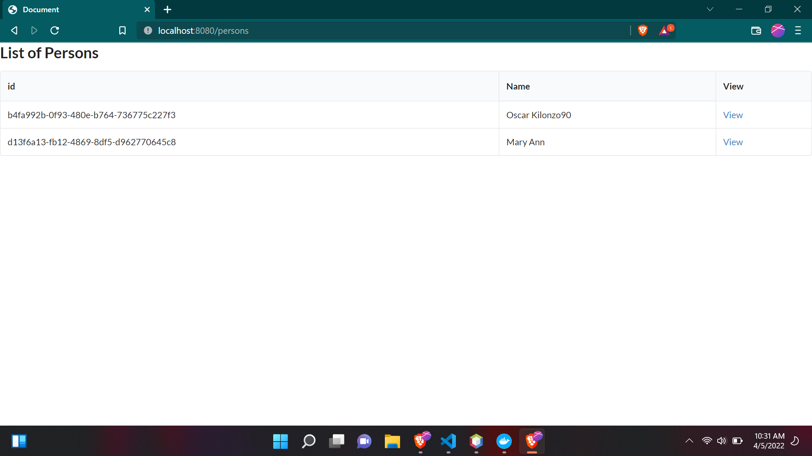
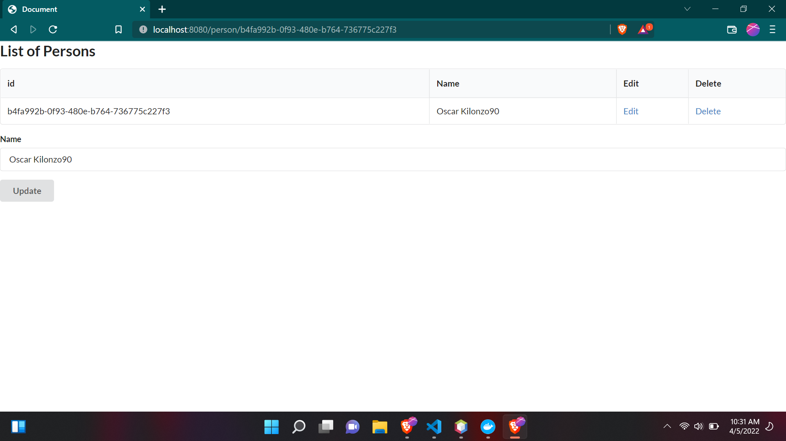

# 1. Create a simple application to demonstrate CRUD. Utilize MVC design pattern.
Based on postgres database there are two controllers one for the web and aonther rest controller. 

## Web controller
```java
/*
 * Click nbfs://nbhost/SystemFileSystem/Templates/Licenses/license-default.txt to change this license
 * Click nbfs://nbhost/SystemFileSystem/Templates/Classes/Class.java to edit this template
 */
package com.mwai.demo.controller;

import com.mwai.demo.model.Person;
import com.mwai.demo.services.PersonService;
import java.util.List;
import java.util.UUID;
import org.springframework.beans.factory.annotation.Autowired;
import org.springframework.stereotype.Controller;
import org.springframework.ui.Model;
import org.springframework.web.bind.annotation.GetMapping;
import org.springframework.web.bind.annotation.PathVariable;
import org.springframework.web.bind.annotation.RequestMapping;
import org.springframework.web.bind.annotation.RequestParam;

/**
 *
 * @author HP
 */
@Controller
public class PersonController {

    private final PersonService personService;

    @Autowired
    public PersonController(PersonService personService) {
        this.personService = personService;
    }
    
    //show  add user view
    @RequestMapping("/add")
    public String createPersonView() {
        return "add";
    }
    
    //handle new user creation
    @RequestMapping("/save")
    public String addPersion(Model model,@RequestParam String name) {
        Person person = new Person(UUID.randomUUID(),name);
        personService.addPerson(person);
        model.addAttribute("name",name);
        return "add";
    }
    
    //list saved persons
    @GetMapping("/persons")
    public String getAllPeople(Model model) {
        List<Person> persons = personService.getAllPeople();
        model.addAttribute("persons", persons);
        return "index";
    }
    
    //show a single person
    @GetMapping("/person/{id}")
    public String getPersonById(Model model,@PathVariable("id") UUID id) {
        Person person = personService.getPersonById(id).orElse(null);
        model.addAttribute("person", person);
        return "view";
    }
    
    //update person
    @RequestMapping("/update")
    public String updatePersonById(Model model,@RequestParam String name,@RequestParam String id) {
        Person person = new Person(UUID.fromString(id),name);
        int result = personService.updatePersonById(UUID.fromString(id), person);
        model.addAttribute("person", person);
        return "view";
    }
    
    //delete a person
    @GetMapping("/person/delete/{id}")
    public String deletePersonById(@PathVariable("id") UUID id) {
        personService.deletePersonById(id);
        return "index";
    }
}
```

## RestController
```java
/*
 * Click nbfs://nbhost/SystemFileSystem/Templates/Licenses/license-default.txt to change this license
 * Click nbfs://nbhost/SystemFileSystem/Templates/Classes/Class.java to edit this template
 */
package com.mwai.demo.controller.api;

import com.mwai.demo.model.Person;
import com.mwai.demo.services.PersonService;
import java.util.List;
import java.util.UUID;
import org.springframework.beans.factory.annotation.Autowired;
import org.springframework.web.bind.annotation.DeleteMapping;
import org.springframework.web.bind.annotation.GetMapping;
import org.springframework.web.bind.annotation.PathVariable;
import org.springframework.web.bind.annotation.PostMapping;
import org.springframework.web.bind.annotation.PutMapping;
import org.springframework.web.bind.annotation.RequestBody;
import org.springframework.web.bind.annotation.RequestMapping;
import org.springframework.web.bind.annotation.RestController;

/**
 *
 * @author HP
 */
@RequestMapping("api/v1/person")
@RestController
public class PersonRestController {

    private final PersonService personService;

    @Autowired
    public PersonRestController(PersonService personService) {
        this.personService = personService;
    }

    @PostMapping
    public void addPersion(@RequestBody Person person) {
        personService.addPerson(person);
    }

    @GetMapping
    public List<Person> getAllPeople() {
        return personService.getAllPeople();
    }

    @GetMapping(path = "{id}")
    public Person getPersonById(@PathVariable("id") UUID id) {
        return personService.getPersonById(id).orElse(null);
    }

    @DeleteMapping(path = "{id}")
    public void deletePersonById(@PathVariable("id") UUID id) {
        personService.deletePersonById(id);
    }

    @PutMapping(path = "{id}")
    public void updatePersonById(@PathVariable("id") UUID id, @RequestBody Person person) {
        personService.updatePersonById(id, person);
    }
}
```





## Web End Points

http://localhost:8080/persons ~ list persons

http://localhost:8080/person/{id} ~ view one person


# 2. Database design:

a. A user management database schema, where users have different roles. Include necessary constraints.


```sql
CREATE TABLE `user` (
  `id` int(11) NOT NULL AUTO_INCREMENT,
  `name` varchar(100) NOT NULL,
  PRIMARY KEY (`id`)
) ENGINE=InnoDB DEFAULT CHARSET=utf8mb4
```

```sql
CREATE TABLE `role` (
  `id` int(11) NOT NULL AUTO_INCREMENT,
  `name` varchar(100) NOT NULL,
  PRIMARY KEY (`id`),
  UNIQUE KEY `name` (`name`)
) ENGINE=InnoDB DEFAULT CHARSET=utf8mb4
```

```sql
CREATE TABLE `user_role` (
  `id` int(11) NOT NULL AUTO_INCREMENT,
  `user_id` int(11) NOT NULL,
  `role_id` int(11) NOT NULL,
  PRIMARY KEY (`id`,`role_id`,`user_id`)
) ENGINE=InnoDB DEFAULT CHARSET=utf8mb4
```

b. Create SQL insert statements, to add 2 sample users, 3 sample roles, and to assign each user to have at least 2 of the created roles.

## insert user
```sql
INSERT INTO `user` (`name`) VALUES ('Mwai John'), ('Mary Atieno');
```

## insert roles
```sql
INSERT INTO `role` (`name`) VALUES ('Administrator'), ('Accountant'),('Clerk');
```

## asign users roles
```sql
INSERT INTO `user_role` (`user_id`, `role_id`) 
 VALUES ('1', '1'), ('1', '2'), ('2', '2'), ('2', '3'), ('3', '1'), ('3', '3');
```


c. Create SQL select statements showing all users and respective roles.

```sql
SELECT user.name as user_name,role.name as role_name from user INNER JOIN user_role ON user_role.user_id= user.id
 INNER JOIN role ON role.id = user_role.role_id;
```

d. Write a select statement that lists all roles for a specific user.

```sql
 SELECT role.name as user_roles from user INNER JOIN user_role ON user_role.user_id= user.id INNER JOIN role ON role.id = user_role.role_id WHERE user.id = 1;
 ```

 e. Write a select statement that lists all users that have a specific role.

```sql
 SELECT user.name as user_name from user INNER JOIN user_role ON user_role.user_id= user.id INNER JOIN role ON role.id = user_role.role_id WHERE role.id = 2;
 ```


## 3. Showcase detailed steps of developing an USSD and an APP mobile applications

### Steps creating UUSD 

(USSD)Unstructured, Supplementary Service Data is a communications protocol used by GSM cellular telephones to communicate with the mobile network operator’s computers.
The steps and concepts involved include 

1. Creating a backend that handles command from the cellular operator

2. Commands are posted by the user and captured on the backed, subsequents prompt are made based on answers sent by the user.

3. To achieve communication between the operator and back end code third party API's such as Africastalking API's are integrated to bridge the gap between the operator and developer code.


### Steps APP mobile applications

Developing a mobile application requires making a decision for which platforms you want to support. For instance you can choose to support Android platform or both Android and IOS platform. In both cases you can chose to have different code bases to support your application or have a single codebase.

To support multiple platforms you can opt to use flutter or react native framework alternatively you can opt to maintain multiple codebases and opt for native android application and IOS swift native application.

### Steps to develop mobile application involve:

1. Strategizing your goal for the app
2. Defining use cases through analysis and planning
3. UI/UX design.
4. App developement
5. Testing
6. Deployment and support


